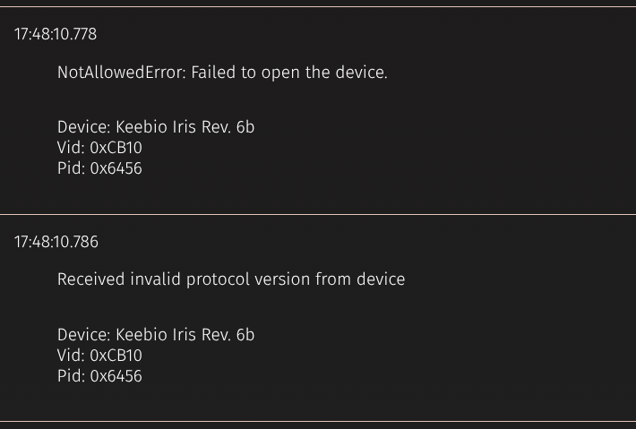

# VIA and Linux

**⚠️ VIA does not work on Firefox-based browsers.**

When using a Chromium-based browser, the web app will throw errors unless the proper permissions in the filesystem are set.



To fix this, 

1. Go to https://usevia.app/.
2. Click `Authorize device` and select the keyboard in the pop-up.
3. Go to [chrome://device-log/](chrome://device-log) and note which file is unable to be opened. The file path will be of the form `/dev/hidraw3`. The number may be different for your system.
4. Open a terminal and give read and write permissions to Others for that file:
    ```
    sudo chmod o+rw /dev/hidraw3
    ```
5. Refresh the [VIA app](https://usevia.app). The keyboard should now be properly recognized.
6. When done editing the keymap, remove the read and write permissions that were added:
    ```
    sudo chmod o-rw /dev/hidraw3
    ```


Source:
- https://github.com/the-via/releases/issues/257#issuecomment-1595811563